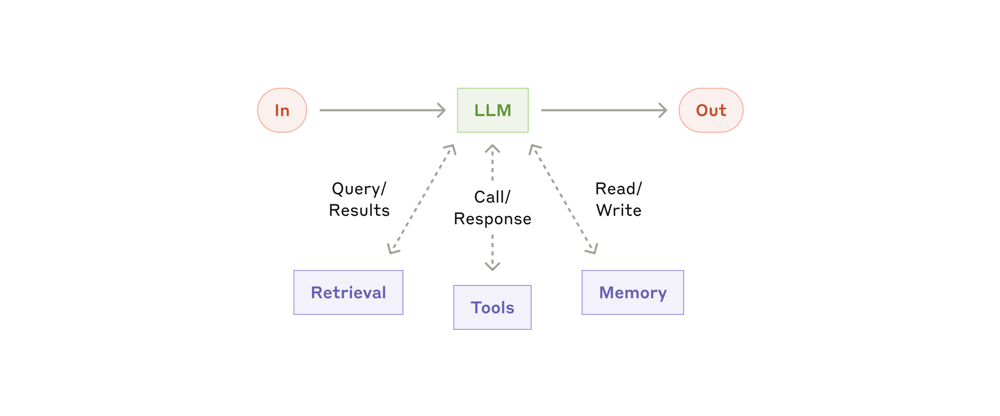
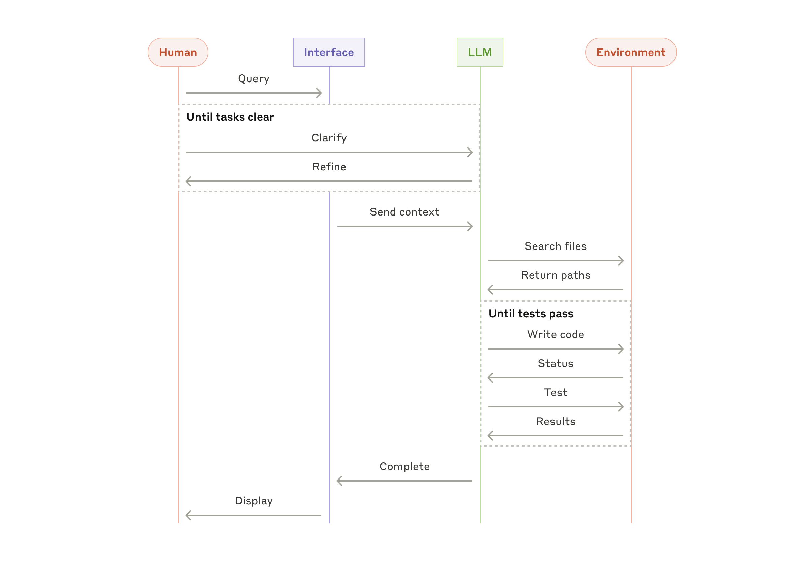

# 构建高效的智能体

发布于 2024 年 12 月 19 日

我们与数十个跨行业构建 LLM 智能体的团队有过合作。一致观察到，最成功的实现依靠的是简单、可组合的模式，而不是复杂的框架。

过去一年里，我们与数十个跨行业构建大语言模型（LLM）智能体的团队合作。一致观察到，最成功的实现既没有使用复杂框架，也没有依赖专用库，而是在用简单、可组合的模式来构建。

在本文中，我们分享与客户合作以及自身构建智能体过程中的心得，并为开发者提供一些构建高效智能体的实用建议。

## 什么是智能体？

"智能体（agent）"有多种定义方式。一些客户把智能体定义为完全自主、能在长时间跨度内独立运作的系统，它们会调用各种工具来完成复杂任务。也有客户用这个词来描述更遵循既定流程的实现——即沿着预定义的工作流执行。在 Anthropic，我们把所有这些变体统称为**智能体系统（agentic systems）**，但在其中做了一个重要的架构区分——**工作流（workflows）**与**智能体（agents）**：

- **工作流**是按预定义代码路径来编排 LLM 与工具的系统。
- **智能体**则相反，是由 LLM 动态决定自身的执行流程与工具调用，并在完成任务的方式上保留自主权。

下文将分别深入探讨这两种智能体系统。在附录 1（"Agents in Practice"）中，我们会介绍两个客户已经在使用这些系统并获得显著价值的领域。

## 何时（以及何时不该）使用智能体

在用 LLM 构建应用时，我们建议先寻找最简单的可行方案，只在确有需要时再增加复杂度——这甚至可能意味着根本不去构建智能体系统。智能体系统通常以更高的延迟和成本为代价来换取更好的任务表现，应当审慎评估这种取舍是否值得。

当确有复杂度需求时，工作流适合那些任务定义明确、需要可预测性和一致性的场景；而智能体则更适合需要在规模化条件下保持灵活性、让模型驱动决策的场景。不过，对多数应用而言，把单次 LLM 调用与检索、上下文示例结合优化，通常就足够了。

## 何时以及如何选择框架

目前有不少框架可以简化智能体系统的实现，包括：

- [Claude Agent SDK](https://platform.claude.com/docs/en/agent-sdk/overview)；
- [Strands Agents SDK（AWS）](https://strandsagents.com/latest/)；
- [Rivet](https://rivet.ironcladapp.com/)，一款拖拽式 LLM 工作流 GUI 构建器；以及
- [Vellum](https://www.vellum.ai/)，另一款用于构建和测试复杂工作流的 GUI 工具。

这些框架通过简化调用 LLM、定义与解析工具、把多个调用串联起来等标准底层任务，让上手变得更容易。但它们往往引入额外的抽象层，掩盖底层的 prompt 与响应，让调试变得更困难；也容易诱使人在简单方案就足够的情况下，不必要地增加复杂度。

我们建议开发者先直接使用 LLM API：很多模式用几行代码就能实现。如果确实要使用框架，请确保自己理解其底层代码——对底层机制的错误假设是客户实践中常见的问题来源。

一些示例实现可参考我们的 [cookbook](https://platform.claude.com/cookbook/patterns-agents-basic-workflows)。

## 构建块、工作流与智能体

本节会展开介绍我们在生产环境中观察到的智能体系统常见模式。我们会从最基础、底层的构建块——增强型 LLM（augmented LLM）——出发，逐步叠加复杂度，从简单的可组合工作流一直推进到自主智能体。

### 构建块：增强型 LLM

智能体系统最基础的构建块是经过增强的 LLM——具备检索、工具、记忆等增强能力。当前的模型可以主动使用这些能力：自己生成搜索查询、选择合适的工具，并决定要保留哪些信息。

实现层面我们建议关注两个关键点：一是把这些能力裁剪到与你的具体用例相匹配；二是为你的 LLM 提供一个易用、文档完善的接口。实现这些增强的方式有多种，其中一种是借助我们最近发布的 [Model Context Protocol（MCP，模型上下文协议）](https://www.anthropic.com/news/model-context-protocol)，通过一个简单的[客户端实现](https://modelcontextprotocol.io/tutorials/building-a-client#building-mcp-clients)就能接入不断壮大的第三方工具生态。

在本文余下部分，我们默认每次 LLM 调用都具备这些增强能力。

### 工作流：提示链

提示链（prompt chaining）把一项任务拆解为一系列步骤，每一步的 LLM 调用处理上一步的输出。你可以在任意中间步骤加编程式检查（见下图中的 "gate"），确保整个流程仍在正确轨道上。

**何时使用该工作流：**当任务可以清晰、干净地拆解为固定子任务时，提示链尤为合适。其核心目标是用更高的延迟换更高的准确率——让每一步 LLM 调用各自承担更简单的任务。

**提示链的适用示例：**

- 先生成营销文案，再把它翻译成另一种语言。
- 先写一份文档大纲，检查大纲是否满足若干标准，再基于该大纲写出完整文档。

### 工作流：路由

路由（routing）先把输入分类，再导向某个专精的后续任务。这种工作流有助于关注点分离，便于构建更专精的 prompt。若不采用路由，针对某一类输入做优化，往往会牺牲其他输入上的表现。

**何时使用该工作流：**当任务较为复杂、可清晰拆分为若干更宜分开处理的类别，且分类能由 LLM 或更传统的分类模型/算法准确完成时，路由是合适的选择。

**路由的适用示例：**

- 把不同类型的客服咨询（一般问题、退款申请、技术支持）分别导向不同的下游流程、prompt 和工具。
- 把简单/常见的问题路由到更小、更具性价比的模型（如 Claude Haiku 4.5），把困难/罕见的问题路由到能力更强的模型（如 Claude Sonnet 4.5），从而在整体上获得最佳性能。

### 工作流：并行化

LLM 有时可以同时处理一项任务，再用编程方式把各自的输出聚合起来。这种工作流（并行化，parallelization）有两种主要变体：

- **分块（Sectioning）**：把任务拆为若干独立的子任务并行执行。
- **投票（Voting）**：对同一任务运行多次以获得多样化的输出。

**何时使用该工作流：**当拆出的子任务可以并行提速，或当需要多视角/多次尝试以获得更高置信度的结果时，并行化是有效的。对于涉及多种考量的复杂任务，LLM 通常在每项考量由独立的 LLM 调用负责时表现更好——这样每个方面都能获得专注的关注。

**并行化的适用示例：**

- **分块**：
  - 实现护栏：一个模型实例处理用户查询，另一个实例专门审查其中是否有违规内容或不当请求。这种做法往往优于让同一次 LLM 调用同时处理护栏与核心回复。
  - 自动化 evals 以评估 LLM 性能：每次 LLM 调用评估模型在某个 prompt 上某个不同维度的表现。
- **投票**：
  - 审查一段代码是否存在漏洞：用若干不同的 prompt 各自审查，一旦发现问题就标记。
  - 评估一段内容是否违规：用多个 prompt 从不同角度评估，或设置不同投票阈值，以在误报与漏报之间取得平衡。

### 工作流：编排者-工作者

在编排者-工作者（orchestrator-workers）工作流中，一个中央 LLM 动态地拆解任务，把子任务委派给若干 worker LLM，再综合它们的结果。

**何时使用该工作流：**该工作流适合那些无法事先预测所需子任务的复杂场景（例如在编码场景中，需要改动的文件数以及每个文件中的改动性质，往往取决于具体任务）。它在拓扑结构上与并行化相似，但与并行化的关键区别在于其灵活性——子任务并非预定义，而是由编排者根据具体输入动态决定。

**编排者-工作者的适用示例：**

- 每次都会对多个文件做复杂改动的编码产品。
- 需要从多个来源收集并分析信息、寻找可能相关内容的研究型检索任务。

### 工作流：评估者-优化者

在评估者-优化者（evaluator-optimizer）工作流中，一个 LLM 调用负责生成响应，另一个 LLM 调用在循环中提供评估与反馈。

**何时使用该工作流：**当存在明确的评估标准、且迭代精化能带来可衡量的价值时，这一工作流尤其有效。是否适合的两条判断信号是：第一，当人类给出具体反馈时，LLM 的响应能有可被观察到的提升；第二，LLM 本身能提供这样的反馈。这类似于人类作者在写一份打磨好的文档时可能要经历的迭代写作过程。

**评估者-优化者的适用示例：**

- 文学翻译：翻译 LLM 初次翻译时可能无法捕捉到某些细微之处，评估 LLM 可以提供有用的批评意见。
- 复杂检索任务：需要多轮搜索与分析才能汇总足够信息，评估者决定是否值得继续进一步搜索。

### 智能体

随着 LLM 在关键能力上日趋成熟——理解复杂输入、参与推理与规划、可靠地使用工具以及从错误中恢复——智能体开始在生产中涌现。智能体的工作起点是接收来自人类用户的一条指令，或与之进行一轮交互式讨论；任务明确后，智能体会自主规划并执行，必要时可再次回到人类处获取更多信息或判断。在执行过程中，关键在于智能体在每一步都从环境获取"真实信号"（如工具调用结果或代码执行结果），以此评估自身进展。智能体可以在检查点暂停以征求人类反馈，也可以在遇到阻塞时暂停。任务通常在完成后终止，但通常也会设置停止条件（例如最大迭代次数）以保持可控。

智能体可以处理复杂任务，但它的实现往往很直接——它本质上就是一个基于环境反馈循环使用工具的 LLM。因此，至关重要的是把工具集及其文档设计得清晰且周到。关于工具开发的更多最佳实践，我们在附录 2（"Prompt Engineering your Tools"）中展开讨论。

**何时使用智能体：**智能体适合那些开放、难以甚至无法预测所需步骤数、且无法硬编码固定路径的问题。LLM 可能需要多轮运行，必须对其决策保有一定信任。智能体的自主性使其成为在受信任环境中规模化任务时的理想选择。

智能体的自主性也意味着更高的成本和复合错误的风险。我们建议在沙盒环境中进行充分测试，并配套适当的护栏。

**智能体的适用示例：**

以下示例来自我们自身的实现：

- 一个用于解决 [SWE-bench 任务](https://www.anthropic.com/research/swe-bench-sonnet) 的编码智能体（coding Agent），该任务会基于任务描述对多个文件做修改；
- 我们的 ["computer use（计算机使用）"参考实现](https://github.com/anthropics/anthropic-quickstarts/tree/main/computer-use-demo)，其中 Claude 通过操作计算机来完成任务。

## 组合与定制这些模式

这些构建块并不是一成不变的处方。它们是开发者可以根据不同用例塑形与组合的常见模式。成功的关键，与任何 LLM 能力一样，在于对实现进行度量与迭代。再次强调：**只有**在确有可被验证的提升时，才考虑增加复杂度。

## 小结

在 LLM 领域取得成功，不在于构建最复杂的系统，而在于为你的需求构建**对**的系统。从简单的 prompt 起步，用完善的评估机制去优化它，只有在更简单的方案不够用时，再引入多步的智能体系统。

在实现智能体时，我们尝试遵循三条核心原则：

1. 在智能体设计中保持**简洁（simplicity）**。
2. 优先保证**透明（transparency）**，把智能体的规划步骤显式呈现出来。
3. 通过充分的工具**文档与测试**，精心打造你的智能体-计算机接口（ACI）。

框架能帮你快速起步，但在向生产推进时，不要犹豫去削减抽象层、回归基础组件。遵循这些原则，你可以打造出不仅强大、而且可靠、易维护、值得用户信任的智能体。

### 致谢

本文由 Erik S. 与 Barry Zhang 撰写。文中观点综合了我们在 Anthropic 构建智能体的亲身实践以及客户分享的宝贵洞见，我们对此深表感谢。

## 附录 1：智能体的实际应用

在与客户合作的过程中，我们发现了两个特别有前景的 AI 智能体应用场景，能很好地展示上文所述模式的实际价值。这两个应用都体现了智能体在以下几类任务中能带来最大价值：既需要对话又需要动作、具备明确的成功标准、可形成反馈循环、并能融入有意义的人类监督。

### A. 客服

客服场景把大家熟悉的聊天机器人界面与工具集成带来的增强能力结合在一起。它天然适合较为开放式的智能体，原因如下：

- 客服交互天然遵循对话流，同时需要访问外部信息与执行外部动作；
- 工具可以集成进来，拉取客户数据、订单历史与知识库条目；
- 退款、改单等动作可以通过编程方式处理；
- 成功与否可以通过用户定义的「问题已解决」明确度量。

已有若干公司通过按用量计费（仅对成功解决的问题收费）的商业模式证明了这一路径的可行性——这本身就是对自家智能体有效性的信心体现。

### B. 编码智能体

软件开发领域已展现出 LLM 能力的巨大潜力——相关能力从最初的代码补全，一路演进到了自主问题求解。智能体在这一领域特别有效，原因如下：

- 代码方案可以通过自动化测试验证；
- 智能体可以利用测试结果作为反馈来迭代方案；
- 问题空间定义明确、结构清晰；
- 输出质量可以客观度量。

在我们自己的实现中，智能体现在已经能够仅凭 PR 描述在 [SWE-bench Verified](https://www.anthropic.com/research/swe-bench-sonnet) 基准上解决真实的 GitHub issue。然而，自动化测试虽能验证功能正确性，人类审阅仍然至关重要——它能确保方案契合更广泛的系统要求。

## 附录 2：工具的 Prompt 工程

无论你在构建哪种智能体系统，工具很可能都是你的智能体中重要的一环。[工具（tools）](https://www.anthropic.com/news/tool-use-ga) 让 Claude 能够通过我们在 API 中规定的精确结构与定义，与外部服务和 API 交互。当 Claude 决定要调用某个工具时，它会在 API 响应中包含一个 [工具使用块（tool use block）](https://docs.anthropic.com/en/docs/build-with-claude/tool-use#example-api-response-with-a-tool-use-content-block)。对工具定义与规范的工程重视程度，应当与对整体 prompt 的重视程度相当。在这篇简短的附录中，我们介绍如何对工具做 prompt 工程。

指定同一个动作往往有多种方式。例如，你可以用 diff 来描述一次文件编辑，也可以用「重写整个文件」的方式描述；返回结构化输出时，你可以把代码放在 markdown 里，也可以放在 JSON 里。在软件工程中，这类差异本质上是表面的，可以无损地相互转换。然而，对 LLM 来说，某些格式写起来比另一些要难得多：写 diff 需要在写出新代码之前，先知道在 chunk 头部究竟要改多少行；把代码放进 JSON（相比放进 markdown）则需要对换行与引号做额外的转义。

关于如何决定工具的格式，我们的建议是：

- 给模型留出足够的 token 去"思考"，别让它一上来就把自己逼入死胡同。
- 让格式尽量贴近模型在互联网自然文本中见过的样子。
- 避免任何额外的"格式开销"——比如让它在写代码时还要精确统计上千行的数量，或对写出的代码做转义。

一个经验法则是：人机界面（HCI）需要花多少精力，**智能体**-计算机接口（ACI）就值得你花同样多的精力。下面是一些具体做法：

- 把自己放到模型的位置上：只看工具的描述与参数，你能不能一眼看出怎么用？如果需要仔细琢磨，那模型多半也一样。一份好的工具定义通常要包含使用示例、边界情况、输入格式要求，以及与其他工具的清晰边界。
- 如何调整参数名或描述，让意图更明显？把它想象成在给团队里的初级开发者写一份优秀的 docstring——这在使用大量相似工具时尤其重要。
- 测试模型如何使用你的工具：在我们的 [workbench](https://console.anthropic.com/workbench) 中跑大量样例输入，观察模型常犯哪些错误，并据此迭代。
- 对你的工具做 [Poka-yoke（防错法）](https://en.wikipedia.org/wiki/Poka-yoke)。调整参数设计，让误用变得难以发生。

在为 [SWE-bench](https://www.anthropic.com/research/swe-bench-sonnet) 构建智能体的过程中，我们花在优化工具上的时间其实多于花在优化整体 prompt 上的时间。例如我们发现：当智能体离开根目录后，使用相对路径的工具会让模型出错。为解决这一问题，我们把工具改为始终要求绝对路径——之后模型用这套方式表现得毫无瑕疵。
